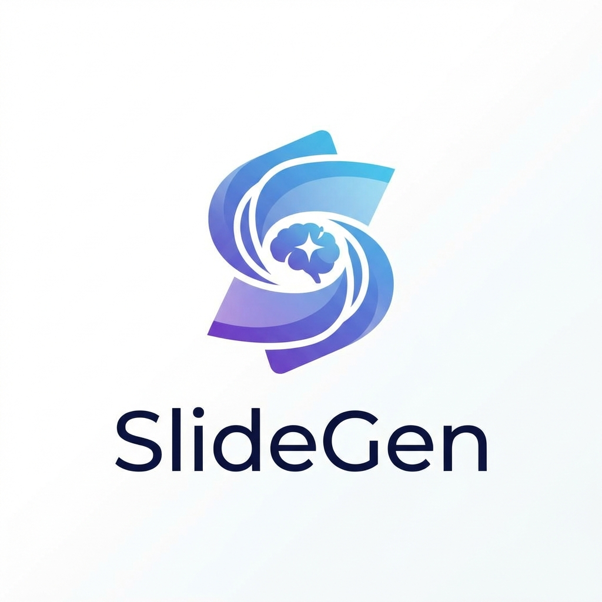

<div align="center">
  <a href="https://github.com/jeesonwang/SlideGen">
    
  </a>

  <h3 align="center">SlideGen</h3>

  <p align="center">
    An AI-powered PowerPoint presentation generator.
    <br />
    <a href="docs/frontendworkflow.md"><strong>Explore the docs »</strong></a>
    <br />
    <br />
    <a href="https://github.com/jeesonwang/SlideGen/issues">Report Bug</a>
    ·
    <a href="https://github.com/jeesonwang/SlideGen/issues">Request Feature</a>
  </p>
</div>

<!-- TABLE OF CONTENTS -->
<details>
  <summary>Table of Contents</summary>
  <ol>
    <li>
      <a href="#about-the-project">About The Project</a>
      <ul>
        <li><a href="#built-with">Built With</a></li>
      </ul>
    </li>
    <li>
      <a href="#features">Features</a>
    </li>
    <li>
      <a href="#getting-started">Getting Started</a>
      <ul>
        <li><a href="#prerequisites">Prerequisites</a></li>
        <li><a href="#installation">Installation</a></li>
      </ul>
    </li>
    <li><a href="#usage">Usage</a></li>
    <li><a href="#roadmap">Roadmap</a></li>
    <li><a href="#license">License</a></li>
    <li><a href="#contact">Contact</a></li>
  </ol>
</details>

<!-- ABOUT THE PROJECT -->
## About The Project

SlideGen is an intelligent agent designed to automate the creation of PowerPoint presentations. By leveraging Large Language Models (LLMs) and Retrieval-Augmented Generation (RAG), SlideGen can generate structured, content-rich slides from simple user prompts or uploaded documents.

### Built With

*   [](https://fastapi.tiangolo.com/)
*   [](https://www.python.org/)
*   [](https://www.postgresql.org/)
*   [](https://redis.io/)
*   [](https://docs.celeryq.dev/)

<!-- FEATURES -->
## Features

SlideGen offers a comprehensive workflow for generating presentations:

*   **Configuration Management**:
    *   Manage connections to various LLM providers (OpenAI, Azure, Anthropic, Ollama, etc.).
    *   Configure Embedding models for knowledge base indexing.
*   **Knowledge Base Management**:
    *   Upload and manage files (PDF, DOCX, etc.) to be used as reference material.
    *   RAG support for generating content based on uploaded documents.
*   **PPT Generation Workflow**:
    *   **Streamed Content Generation**: Real-time generation of presentation outlines and content in Markdown format.
    *   **Interactive Editing**: Edit the generated content before finalizing the slides.
    *   **PPTX Export**: Convert the finalized Markdown into a polished PowerPoint file (`.pptx`).

<!-- GETTING STARTED -->
## Getting Started

To get a local copy up and running, follow these simple steps.

### Prerequisites

*   Python 3.11+
*   PostgreSQL
*   Redis

### Installation

1.  Clone the repo
    ```sh
    git clone https://github.com/jeesonwang/SlideGen.git
    cd SlideGen
    ```
2.  Install dependencies
    *   Using `uv` (Recommended):
        ```sh
        uv sync
        ```
    *   Or using `pip`:
        ```sh
        pip install -r requirements.txt
        ```
3.  Set up environment variables
    *   Copy the sample environment file:
        ```sh
        cp .env.sample .env
        ```
    *   Update `.env` with your database credentials, API keys, and other configuration settings.

<!-- USAGE EXAMPLES -->
## Usage

1.  Start the application server:
    ```sh
    python main.py
    ```
    The server will start at `http://127.0.0.1:7860`.

2.  Access the API documentation:
    *   Swagger UI: `http://127.0.0.1:7860/docs`
    *   ReDoc: `http://127.0.0.1:7860/redoc`

<!-- LICENSE -->
## License

Distributed under the MIT License. See `LICENSE` for more information.

<!-- CONTACT -->
## Contact

Project Link: [https://github.com/jeesonwang/SlideGen](https://github.com/jeesonwang/SlideGen)
